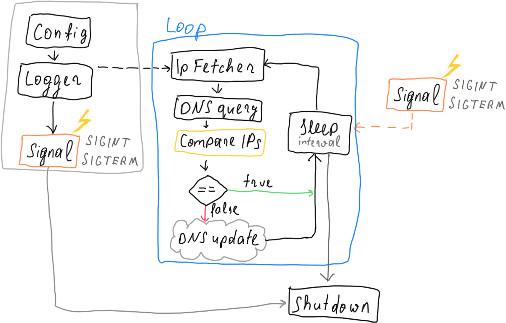

# Architecture

The following steps describe the initialization of the application:

* First an early logger is setup to log any issues with config setup.
* The global config is assembled from environment variables, command line arguments
  and a possible config file.
* A new logger instance is set up using the created configuration.
* Signal handling for double `Ctrl-C` invocation is set up to terminate the
  application
* The DO updater service is spawned on a new thread.
* The main thread blocks on regular termination signals to notify the updater
  thread when to quit.

  
The following image presents the overall components interacting in the 
updater service:

* The `DnsIpFetcher` fetches the public IP from an external service.
* The `DomainRecordUpdater` queries and update the domain records using DO API

# Docker images

Docker builds are done using the cross-compilers provided by the following images

* https://github.com/emk/rust-musl-builder (for `linux/amd64`)
* https://github.com/messense/rust-musl-cross (for `linux/arm/v7` and `linux/arm64"`)

The application images are built using a multi-stage Dockerfile which are ran in
Github Actions jobs using a combination of the `docker/build-push-action@v2` action 
and shell code to create and push a multi-arch manifest list to the docker registries.

The final runtime images are based on alpine:latest.
